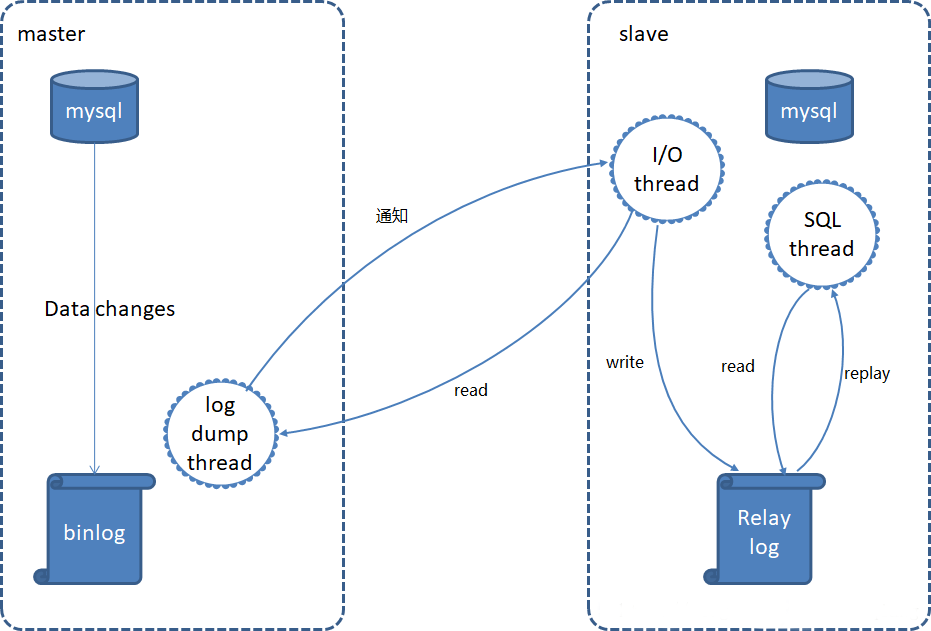

## 一、概述
`MySQL` 是一种开源的关系型数据库管理系统（`RDBMS`），以其快速、可靠和易于使用而受到广泛的欢迎。`MySQL` 使用 `SQL`（结构化查询语言）进行查询、管理和操作数据。`MySQL` 是一种跨平台的数据库，支持在各种操作系统（如 `Windows、Linux、MacOS`等）上运行。

`MySQL` 中的重要概念包括：

- **数据库**：指的是一个完整的数据集合，其中包含多个表。

- **表**：是一个数据实体的二维结构，在表中我们可以以行和列的形式来操作数据。

- **列**：表中一个字段的名称。

- **行**：表中的具体数据。

- **主键**：用于唯一标识表中的每一行数据的字段。

- **外键**：用于关联表之间数据的字段。

- **索引**：用于加速数据的查询，可以通过特定的属性来提高查询性能。

- **视图**：是一个虚拟表，它通过查询获取数据。

MySQL 中比较常用的命令包括：

- `CREATE DATABASE`: 创建一个新的数据库。

- `CREATE TABLE`: 创建一个新的表。

- `INSERT INTO`: 向表中插入新的数据。

- `SELECT`: 从表中查询数据。

- `UPDATE`: 更新表中的数据。

- `DELETE`: 删除表中的数据。

- `ALTER TABLE`: 修改表的结构。

- `DROP TABLE`: 删除一个表。

- `DROP DATABASE`: 删除一个数据库。

- `USE`: 切换使用的数据库。

- `SHOW DATABASES`: 显示所有可用的数据库。

- `SHOW TABLES`: 显示数据库中的所有表。

除了上述基本命令之外，MySQL 还支持事务处理、触发器、存储过程等高级特性。掌握 MySQL 的使用，可以帮助我们更好地进行数据存储、管理和处理。想了解更多MYSQL的知识点可参考我以下几篇文章：
- [MySQL原理介绍](https://mp.weixin.qq.com/s?__biz=MzI3MDM5NjgwNg==&mid=2247485107&idx=1&sn=38a4975856ca05a635dff1699d023370&chksm=ead0fa5adda7734c8af45d92d3db45cfdfa9ed90497abd5245aed1d0bc3e69b9e79e27c6e6e1&scene=21#wechat_redirect)
- [MySQL高可用实战（ MHA）](https://mp.weixin.qq.com/s?__biz=MzI3MDM5NjgwNg==&mid=2247485108&idx=1&sn=9e878945cb828a793efa82062deefe5b&chksm=ead0fa5ddda7734b1da3effb09c17d684e088cab43cde8cbc76f9b06c0eac53a4685d622ddd7&token=2026700999&lang=zh_CN#rd)


## 二、前期准备
### 1）部署 docker
```bash
# 安装yum-config-manager配置工具
yum -y install yum-utils

# 建议使用阿里云yum源：（推荐）
#yum-config-manager --add-repo https://download.docker.com/linux/centos/docker-ce.repo
yum-config-manager --add-repo http://mirrors.aliyun.com/docker-ce/linux/centos/docker-ce.repo

# 安装docker-ce版本
yum install -y docker-ce
# 启动并开机启动
systemctl enable --now docker
docker --version
```
### 2）部署 docker-compose
```bash
curl -SL https://github.com/docker/compose/releases/download/v2.16.0/docker-compose-linux-x86_64 -o /usr/local/bin/docker-compose

chmod +x /usr/local/bin/docker-compose
docker-compose --version
```
## 三、创建网络

```bash
# 创建，注意不能使用hadoop_network，要不然启动hs2服务的时候会有问题！！！
docker network create hadoop-network

# 查看
docker network ls
```
## 四、MySQL 编排部署
### 1）构建镜像 Dockerfile

```bash
docker pull mysql:5.7

docker tag mysql:5.7 registry.cn-hangzhou.aliyuncs.com/bigdata_cloudnative/mysql-test:5.7

# 推送镜像
docker push registry.cn-hangzhou.aliyuncs.com/bigdata_cloudnative/mysql-test:5.7
```
### 2）配置文件

```bash
mkdir ./conf
cat >./conf/my.cnf<<EOF
[mysqld]
user=mysql
default-storage-engine=INNODB
character-set-server=utf8
[client]
default-character-set=utf8
[mysql]
default-character-set=utf8
EOF
```
### 2）编排 docker-compose.yaml

```bash
version: '3'
services:
  mysql-test:
    image: registry.cn-hangzhou.aliyuncs.com/bigdata_cloudnative/mysql-test:5.7
    restart: always
    container_name: mysql-test
    hostname: mysql-test
    environment:
      MYSQL_ROOT_PASSWORD: 123456
      TZ: Asia/Shanghai
    ports:
      - 3306:3306
    volumes:
      - ./data:/var/lib/mysql
      - ./conf/my.cnf:/etc/mysql/my.cnf
    command:
      --max_connections=1000
      --character-set-server=utf8mb4
      --collation-server=utf8mb4_general_ci
      --default-authentication-plugin=mysql_native_password
    networks:
      - hadoop-network
    healthcheck:
      test: ["CMD-SHELL", "curl --silent localhost:3306 >/dev/null || exit 1"]
      interval: 10s
      timeout: 10s
      retries: 3

# 连接外部网络
networks:
  hadoop-network:
    external: true
```

### 3）开始部署

```bash
docker-compose -f docker-compose.yaml up -d

# 查看
docker-compose -f docker-compose.yaml ps
```
## 五、简单测试验证

```bash
# 登录容器
docker exec -it mysql-test bash

# 登录mysql
mysql -uroot -p
输入密码：123456

show databases;
```
## 六、常用的 MySQL 客户端命令
MySQL 是一种常用的关系型数据库，我们可以通过客户端连接MySQL服务器，并执行各种SQL语句来对数据库进行管理。下面列举一些常用的 MySQL 客户端命令：

### 1）连接到MySQL服务器
```bash
mysql -u username -p password -h host -P port
```
其中，`-u` 表示用户名，`-p` 表示密码，`-h` 表示服务器主机名或IP地址，`-P` 表示端口号。

### 2）显示当前数据库列表
```sql
show databases;
```
### 3）选择数据库

```sql
use database_name;
```
其中，`database_name` 为要选择的数据库名。
### 4）显示当前数据库的所有表

```sql
show tables;
```
### 5）显示表的结构

```sql
describe table_name;
```
其中，`table_name` 为要查看结构的表名。

### 6）插入数据
```sql
insert into table_name (field1, field2, ...) values (val1, val2, ...);
```
其中，`table_name` 为需要插入数据的表名，`field1, field2,...` 为字段名，`val1, val2,...` 为要插入的对应值。

### 7）删除数据

```sql
delete from table_name where condition;
```
其中，`table_name` 为需要删除数据的表名，`condition` 为删除数据的条件。
### 8）修改数据

```sql
update table_name set column1 = value1, column2 = value2 where condition;
```
其中，`table_name` 为需要修改数据的表名，`column1、column2` 为需要修改的列名，`value1、value2` 为要更新的值，`condition` 为更新条件。

这些是MySQL客户端常用的命令，能够覆盖数据库管理中的大部分操作。需要注意的是，MySQL客户端命令在语法和使用上可能有细微的差别，具体还需根据实际情况具体使用。

---

以上就是通过 docker-compose 快速部署 MySQL保姆级教程，有任何疑问欢迎留言或关注我公众号【**大数据与云原生技术分享**】加群交流或私信沟通~


